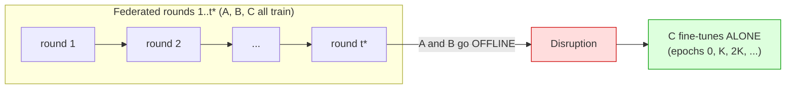
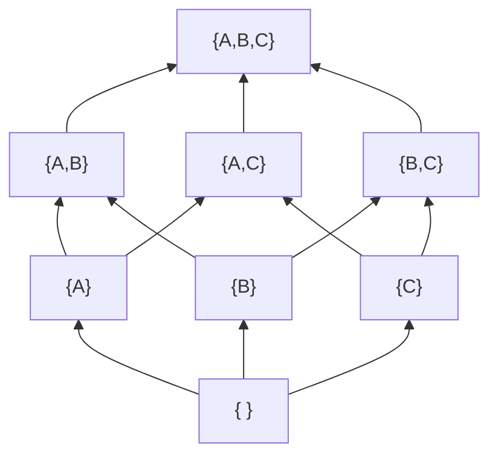
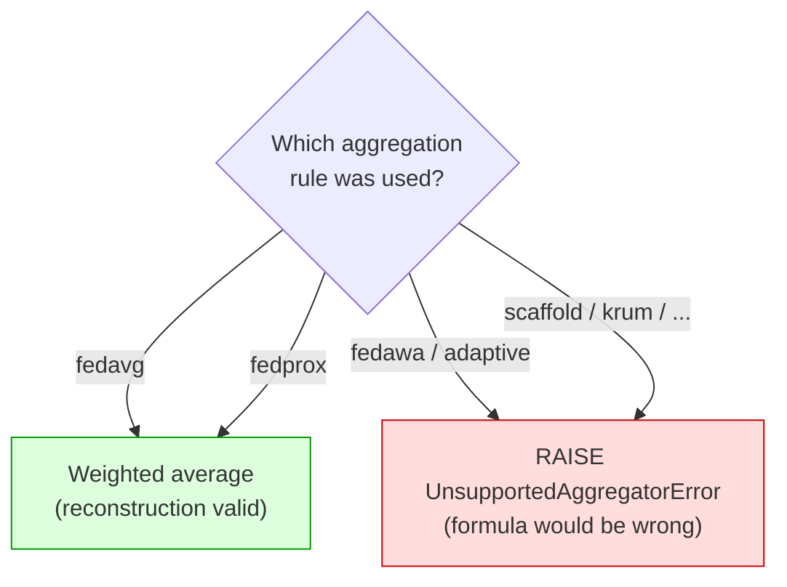
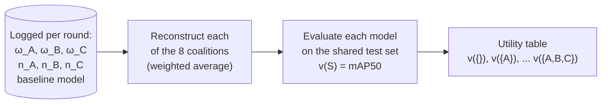
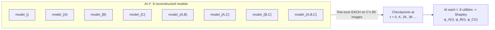
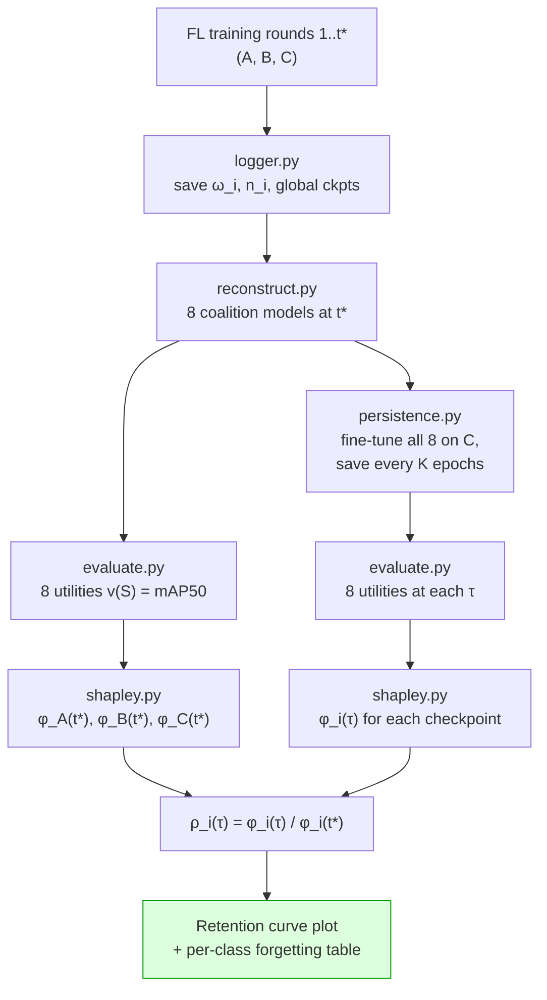

# Shapley-Based Contribution Persistence — Explained From Scratch

> A guided tour of *why* and *how* we measure how much of Factory A's and
> Factory B's contribution **survives** while Factory C fine-tunes the model
> alone. Written for someone who has never seen Shapley values or federated
> learning. Read top to bottom; each section builds on the last.

**Companion code:** [`shapley/`](../shapley/)

---

## Table of contents

1. [The story: three factories and a blackout](#1-the-story-three-factories-and-a-blackout)
2. [The one question we're answering](#2-the-one-question-were-answering)
3. [Warm-up: what is a Shapley value?](#3-warm-up-what-is-a-shapley-value)
4. [Our "players" and our "payout"](#4-our-players-and-our-payout)
5. [The magic trick: reconstruction instead of retraining](#5-the-magic-trick-reconstruction-instead-of-retraining)
6. [Computing the 8 utilities](#6-computing-the-8-utilities)
7. [The exact Shapley formula, worked by hand](#7-the-exact-shapley-formula-worked-by-hand)
8. [Persistence: the retention curve](#8-persistence-the-retention-curve)
9. [The cheap corroborating metric: forgetting](#9-the-cheap-corroborating-metric-forgetting)
10. [Why each acceptance test exists](#10-why-each-acceptance-test-exists)
11. [How it all maps to the code](#11-how-it-all-maps-to-the-code)
12. [Glossary](#12-glossary)

---

## 1. The story: three factories and a blackout

We are training a computer-vision model that spots **defects on steel strips**
(three kinds: *Inclusion*, *Patches*, *Scratches*). Three factories each hold
their own photos and **never share the raw images** — only model weights. This
is **federated learning (FL)**.

The three factories are deliberately unequal:

| Factory | Code name | Train images | Character |
|--------:|:---------:|:------------:|:----------|
| Client 0 | **A** | 457 (≈60%) | Big, lots of every class |
| Client 1 | **B** | 228 (≈30%) | Medium |
| Client 2 | **C** |  80 (≈10%) | Tiny, 81% Scratches, barely sees Inclusion/Patches |

They train together for several rounds. Then a **disruption** happens:



At round `t*`, factories **A and B shut down** (imagine a real blackout). Only
the small factory **C** is left, and it keeps improving the model using *only its
own 80 images*.

The worry: C is tiny and lopsided. If it fine-tunes for a long time, it might
**overwrite** the useful knowledge that A and B baked into the shared model —
especially about the classes C rarely sees (Inclusion, Patches). The hope: the
shared model carries enough of A's and B's "wisdom" that C stays good at *all*
classes, not just Scratches.

---

## 2. The one question we're answering

> **As C fine-tunes alone, how much of A's and B's contribution to the model
> still persists — and how fast does it fade?**

We want a **decay curve**: on the x-axis, how long C has been fine-tuning; on the
y-axis, the *fraction of A's (or B's) original contribution that remains*.

```
 fraction of A's contribution still present
 1.0 |*  .
     |   '*.
     |      '*.___             <- A's knowledge slowly fading as C overwrites it
     |          '''*--.____
 0.0 +---------------------------->  C's fine-tuning progress (epochs)
     t*        K      2K     3K
```

To draw that curve we need a **number** that says "how much did A contribute?" at
any given checkpoint. That number is a **Shapley value**. So first we have to
understand Shapley values.

---

## 3. Warm-up: what is a Shapley value?

Forget machine learning for a moment. Shapley values answer a classic **fair
credit** question.

### The band royalties analogy

Three musicians — **A**, **B**, **C** — record a song together. It earns \$0.82
of "goodness" (we'll define goodness later). How much of that \$0.82 did each
person *fairly* earn? You can't just split it equally, because some contributed
more. And you can't just ask "how good is A alone?", because part of A's value
only shows up *in combination* with the others.

Shapley's idea (1953, later a Nobel-adjacent result in economics):

> A player's fair share = **their average marginal contribution**, averaged over
> *every possible order* in which the group could have formed.

"Marginal contribution" = *how much better does the group get the moment this
player walks in?*

### Tiny numeric example

Say the "goodness" of every possible subgroup (**coalition**) is:

| Coalition | Goodness `v` |
|:---------:|:------------:|
| nobody `{}` | 0.33 |
| `{A}` | 0.55 |
| `{B}` | 0.50 |
| `{C}` | 0.40 |
| `{A,B}` | 0.75 |
| `{A,C}` | 0.65 |
| `{B,C}` | 0.60 |
| `{A,B,C}` | 0.82 |

There are **6 orders** the trio could form (ABC, ACB, BAC, BCA, CAB, CBA). Let's
track **A's marginal contribution** in each order — i.e. the jump in goodness the
instant A joins:

| Order | Who's there when A joins | Before A | After A | A's jump |
|:-----:|:------------------------:|:--------:|:-------:|:--------:|
| **A**BC | nobody | 0.33 | 0.55 | **0.22** |
| **A**CB | nobody | 0.33 | 0.55 | **0.22** |
| B**A**C | {B} | 0.50 | 0.75 | **0.25** |
| C**A**B | {C} | 0.40 | 0.65 | **0.25** |
| BC**A** | {B,C} | 0.60 | 0.82 | **0.22** |
| CB**A** | {B,C} | 0.60 | 0.82 | **0.22** |

Average of A's jumps = (0.22+0.22+0.25+0.25+0.22+0.22) / 6 = **0.230**.

So **A's Shapley value is φ_A = 0.230**. Do the same bookkeeping for B and C and
you get φ_B = 0.180 and φ_C = 0.080. (We'll re-derive these with a shortcut in
§7 — and yes, these exact numbers are a unit test in our code.)

### Two properties that make Shapley "fair"

- **Efficiency** — the shares add up to the whole:
  `φ_A + φ_B + φ_C = v({A,B,C}) − v({})`.
  Check: 0.230 + 0.180 + 0.080 = 0.490 = 0.82 − 0.33. ✓
- **Symmetry** — two players who contribute identically get identical shares.
- **Null player** — a player who never changes any coalition's goodness gets 0.

These three properties are exactly why we trust Shapley for "who contributed what,"
and they become **acceptance tests** in §10.

---

## 4. Our "players" and our "payout"

Now translate the band analogy to our problem.

### Players = the 3 factories (not images!)

A crucial design choice: the **players are the 3 clients A, B, C** — *not* the
individual training images. Why does this matter so much?

- With 3 players there are only **2³ = 8 coalitions**. We can evaluate *all of
  them* and compute Shapley **exactly** — no approximation, no random sampling.
- If players were images (hundreds of them) there'd be 2³⁰⁰ coalitions and we'd
  be forced into Monte-Carlo estimation. We dodge that entirely.

The 8 coalitions form a little cube (the "coalition lattice"):



### Payout = model quality on the shared test set (mAP50)

The "goodness" `v(S)` of a coalition `S` is **how good the model built from
coalition S is at detecting defects** — measured on the **shared test set** of 45
balanced images (15 per class) that *no factory trained on*.

The quality metric is **mAP50** ("mean Average Precision at IoU 0.50"). You don't
need the full definition; just hold onto this:

> **mAP50 is a single number in [0, 1]. Higher = the detector finds defects more
> accurately.** It's the standard scoreboard for object detection.

One honest caveat that shapes our code: unlike classification "accuracy," mAP can
make a coalition *worse* — so **`v(S)` can go down when you add a player, and
Shapley values can be negative.** Our code is built to tolerate that (no assuming
positivity).

So, concretely:

```
v(S) = mAP50( model_of_coalition_S , shared_test_set )
```

Now the only missing piece is: **how do we get "the model of coalition S" without
retraining 8 times?** That's the clever part.

---

## 5. The magic trick: reconstruction instead of retraining

### The naive (expensive) way

To get `v({A,C})` you might think: "re-run federated training using only A and C,
get a model, test it." Doing that for all 8 coalitions means running FL **8 times**.
Slow and wasteful.

### The shortcut: FedAvg is just a weighted average

Here's the key fact about the **FedAvg** aggregation rule our experiment uses.
Every round, each factory trains locally and sends its **full set of model
weights** back. The server combines them by a **weighted average**, where each
factory's weight is its number of training images `n_i`:

$$
\omega_S \;=\; \sum_{i \in S} \frac{n_i}{n_S}\,\omega_i
\qquad\text{where}\quad n_S = \sum_{i \in S} n_i
$$

In words: **the coalition's model is just the image-count-weighted average of its
members' models.** Averaging is cheap and we already logged each factory's
weights `ωᵢ` and image count `nᵢ`. So we can **rebuild any coalition's model by
re-doing the average with only that coalition's members** — no training required.

> **Analogy.** Suppose a class's final grade is a weighted average of everyone's
> homework. To find "what would the average be with only students A and C?" you
> don't re-teach the course — you just recompute the average over A and C. Same
> idea, but the "grades" are neural-network weight tensors.

### Worked reconstruction example (real numbers)

Image counts: `n_A = 457`, `n_B = 228`, `n_C = 80`.

Pretend a single weight in the network came out like this after one round:

| Factory | that weight `ωᵢ` |
|:-------:|:----------------:|
| A | 0.90 |
| B | 0.40 |
| C | 0.10 |

**Coalition {A, B}** — total images `n_S = 457 + 228 = 685`:

```
ω_{A,B} = (457/685)·0.90 + (228/685)·0.40
        = 0.667·0.90     + 0.333·0.40
        = 0.600          + 0.133
        = 0.733
```

**Coalition {A, B, C}** — total `n_S = 457 + 228 + 80 = 765`:

```
ω_{A,B,C} = (457/765)·0.90 + (228/765)·0.40 + (80/765)·0.10
          = 0.5373·0.90    + 0.2980·0.40    + 0.1046·0.10
          = 0.4836         + 0.1192         + 0.0105
          = 0.613
```

We do this for **every weight in the network at once** (they're just big arrays),
and for **every coalition**. Note the big factory A dominates the average — that's
realistic and it's exactly what Shapley will later quantify.

**Empty coalition `{}`** has no members to average, so `v({})` uses a **baseline
model** — the pre-round global model (or a random-init model). It's the "goodness
of a model nobody improved," our zero-point.

### Two subtleties the code handles carefully

1. **FedProx gives the *same* server math as FedAvg.** FedProx only changes what
   each factory does *locally* (it adds a "don't drift too far" penalty during
   training). The **server still does the identical weighted average**. So our
   reconstruction code treats `fedavg` and `fedprox` as the same rule — no special
   case. (This is why they share one code path.)

2. **Other rules would break the formula.** This repo also has strategies called
   `fedawa` and `adaptive` that weight factories by *cosine similarity* or
   *precision/recall*, **not** by image count. If someone ran the experiment with
   those, the weighted-average formula above would give **wrong** Shapley values.
   So the reconstruction code **refuses** those rules with a loud error instead of
   silently computing nonsense. (Same warning applies to SCAFFOLD / FedNova /
   median / Krum if ever added.)



---

## 6. Computing the 8 utilities

Putting §4 and §5 together, here's the pipeline that turns *logged weights* into
the *8 numbers* Shapley needs:



After this we have a filled-in table exactly like the one in §3, e.g.:

| S | `{}` | `{A}` | `{B}` | `{C}` | `{A,B}` | `{A,C}` | `{B,C}` | `{A,B,C}` |
|:-:|:----:|:-----:|:-----:|:-----:|:-------:|:-------:|:-------:|:---------:|
| v(S) | 0.33 | 0.55 | 0.50 | 0.40 | 0.75 | 0.65 | 0.60 | 0.82 |

(These specific numbers are illustrative — real ones come from mAP50 on the test
set.)

---

## 7. The exact Shapley formula, worked by hand

For **N = 3 players** there's a clean closed form. For player `i`:

$$
\phi_i \;=\; \sum_{S \,\not\ni\, i} w(|S|)\,\bigl(\,v(S \cup \{i\}) - v(S)\,\bigr)
$$

- `S` ranges over every coalition that **does not** already contain `i`
  (for player A: `{}`, `{B}`, `{C}`, `{B,C}` — four of them).
- `v(S ∪ {i}) − v(S)` is `i`'s **marginal contribution** — the jump when `i` joins `S`.
- `w(|S|)` is a weight that depends on how big `S` is:

| size of `S` | weight `w` |
|:-----------:|:----------:|
| 0 (`{}`)    | **1/3** |
| 1 (`{B}` or `{C}`) | **1/6** |
| 2 (`{B,C}`) | **1/3** |

(These weights come from "average over all orderings"; the middle coalitions get
less weight because there are two of them.)

### Compute φ_A step by step

Using the table from §6:

| `S` (no A) | `v(S∪A) − v(S)` | jump | weight | weight × jump |
|:----------:|:----------------|:----:|:------:|:-------------:|
| `{}`   | 0.55 − 0.33 | 0.22 | 1/3 | 0.0733 |
| `{B}`  | 0.75 − 0.50 | 0.25 | 1/6 | 0.0417 |
| `{C}`  | 0.65 − 0.40 | 0.25 | 1/6 | 0.0417 |
| `{B,C}`| 0.82 − 0.60 | 0.22 | 1/3 | 0.0733 |
| | | | **φ_A =** | **0.230** |

Do the same for B and C:

- **φ_B = 0.180**
- **φ_C = 0.080**

### Sanity check with the efficiency property

```
φ_A + φ_B + φ_C = 0.230 + 0.180 + 0.080 = 0.490
v({A,B,C}) − v({}) = 0.82 − 0.33          = 0.490   ✓
```

They match — the three fair shares exactly account for the total quality the full
team adds over the baseline. Notice the ranking **A > B > C**, matching intuition:
the big factory contributed most, the tiny one least. This exact worked example
(`0.230 / 0.180 / 0.080`) is hard-coded as a unit test so we know the
implementation is correct.

> **Note:** there's also a general factorial-weight formula that works for any
> number of players. We keep it in the code as a documented fallback and *test
> that it agrees with the N=3 shortcut* — but the experiment only ever needs N=3.

---

## 8. Persistence: the retention curve

Everything so far gives us Shapley values **at one moment**. Now we measure how
they **change as C fine-tunes**. This is the actual research question.

### Step 1 — the "before" snapshot at the disruption round `t*`

At the disruption round `t*` (we pick an **early** round, while the model is still
improving — not the very end), reconstruct the 8 coalitions, evaluate, and compute
Shapley. Call these the **baseline contributions**:

```
φ_A(t*),  φ_B(t*),  φ_C(t*)      <- "how much each factory had contributed by t*"
```

### Step 2 — let each coalition keep going *with only C*

Here's the part specific to our disruption story. After `t*`, only C trains. To
see how A's and B's contributions **decay under C's solo fine-tuning**, we take
**each of the 8 reconstructed coalition models** and **fine-tune it on C's data**,
saving a checkpoint every `K` epochs:



Why fine-tune *all 8* and not just the full model? Because Shapley at time τ needs
the goodness of *every* coalition at time τ. Reconstruction already saved us from
re-running federated training 8 times; but the **C-fine-tuning itself is the very
thing we're measuring**, so it can't be skipped. The good news: C has only 80
images, so these 8 fine-tunes are cheap.

> **What does φ_A(τ) mean intuitively?** "After C has been fine-tuning for τ
> epochs, how much is A's original round-`t*` knowledge *still* worth on the
> margin?" As C keeps overwriting the shared weights with its Scratches-heavy
> data, A's marginal value should shrink → the number decays.

### Step 3 — the retention ratio

Finally, normalize each factory's contribution against its own "before" value:

$$
\rho_i(\tau) \;=\; \frac{\phi_i(\theta_\tau)}{\phi_i(\theta_{t^*})}
$$

- `ρ_i(0) = 1` by construction (nothing fine-tuned yet → 100% retained).
- `ρ_i(τ)` drifting toward 0 → factory i's contribution is being forgotten.
- `ρ` could even go **negative** or **spike** if `φ_i(t*)` is near zero — that's
  why we picked an *early, still-improving* `t*` where contributions are clearly
  nonzero, and why the code guards against dividing by a near-zero denominator.

### Example retention table

| Fine-tune epochs τ | φ_A(τ) | ρ_A(τ) | φ_B(τ) | ρ_B(τ) |
|:------------------:|:------:|:------:|:------:|:------:|
| 0 (at t*)          | 0.230  | 1.00   | 0.180  | 1.00   |
| K                  | 0.180  | 0.78   | 0.130  | 0.72   |
| 2K                 | 0.120  | 0.52   | 0.080  | 0.44   |
| 3K                 | 0.070  | 0.30   | 0.040  | 0.22   |

Plotting `ρ_A` and `ρ_B` versus τ **is the deliverable** — the decay curve from §2.
A curve that stays high means the FL knowledge is "sticky" (C benefits long after
the blackout); a curve that crashes means C quickly overwrites it.

---

## 9. The cheap corroborating metric: forgetting

Shapley is the headline number, but we also compute a **simpler sanity check** that
should tell the same story. Because C is 81% Scratches and barely sees Inclusion or
Patches, the fear is that fine-tuning makes the model **forget the classes A and B
dominated**.

So at every fine-tuning checkpoint we also record **per-class accuracy** (per-class
mAP/AP) and watch the classes A and B were strong at:

```
per-class mAP50 on the shared test set
        Scratches (C's class)  ___...---'''      <- goes UP (C is training on it)
  ---''''
        Inclusion / Patches  '''---...___        <- goes DOWN = "forgetting"
                                       (A/B's classes)
        --------------------------------------->  fine-tuning epochs
```

This "**backward transfer / forgetting**" number is cheap (it's already computed
during evaluation) and should **move in the same direction as `ρ`**: if A's Shapley
retention `ρ_A` falls, the accuracy on A's dominant classes should fall too. When
two independent measurements agree, the story is trustworthy.

---

## 10. Why each acceptance test exists

Good research code proves itself. Each test below pins down one property so a
future change can't silently break the math. (All are in [`shapley/tests/`](../shapley/tests/)
and currently pass.)

| # | Test | What it guarantees | Why you should care |
|:-:|:-----|:-------------------|:--------------------|
| 1 | **Efficiency** | `φ_A+φ_B+φ_C == v(all) − v({})` at every checkpoint | If shares didn't sum to the total, they wouldn't be a fair split — the whole method would be meaningless. |
| 2 | **Worked example** | The `0.33/0.55/.../0.82` table yields exactly `0.230 / 0.180 / 0.080` | Locks the formula to a hand-checkable answer, so a typo in the weights is caught instantly. |
| 3 | **Symmetry** | Two factories with identical logged updates get equal `φ` | Confirms we're not accidentally favoring "factory A" just because of its position/order. |
| 4 | **Null player** | A factory whose update changes nothing gets `φ ≈ 0` | A factory that adds no value should get no credit — basic fairness. |
| 5 | **Reconstruction sanity** | Rebuilding `{A,B,C}` from logs reproduces the model the server actually aggregated (max abs diff < tol) | Proves the "retrain-free average" really equals real FedAvg — otherwise every utility would be subtly wrong. |

Test 5 is verified against an **independent** averaging implementation
(`np.average` with weights), so it's a genuine cross-check, not the code grading
its own homework.

---

## 11. How it all maps to the code

```
shapley/
  shapley.py       §7  exact N=3 Shapley (weights 1/3, 1/6) + factorial fallback
  reconstruct.py   §5  weighted-average reconstruction; fedavg == fedprox;
                       refuses fedawa/adaptive/etc. with a clear error
  evaluate.py      §4  v(S) = mAP50 on the shared test set   (to be wired to YOLO)
  logger.py        §6  non-invasively record ω_i, n_i, and per-round global
                       checkpoints during training           (to be added)
  persistence.py   §8  driver: reconstruct -> fine-tune 8 coalitions on C ->
                       Shapley per τ -> retention curve + forgetting  (to be added)
  tests/           §10 the five acceptance tests (all passing)
```

Build order (already followed): the **pure math** — `reconstruct.py`, `shapley.py`,
and their tests — came **first**, because they need no training data and can be
verified on synthetic numbers. Only once that core is trustworthy do we wire it to
the real model (logger → evaluator → persistence driver). The logger and the
fine-tuning checkpoints touch the training pipeline, so those steps pause for
sign-off before modifying anything.

### The end-to-end picture on one page



---

## 12. Glossary

| Term | Plain-English meaning |
|:-----|:----------------------|
| **Federated learning (FL)** | Many parties train one shared model without sharing raw data — only weights. |
| **Client / factory** | One participant (A, B, or C). Our Shapley "players." |
| **Round** | One cycle of "everyone trains locally, server averages." |
| **FedAvg** | Aggregation rule: server = image-count-weighted average of client weights. |
| **FedProx** | FedAvg + a local "stay close to the global model" penalty. **Same server math as FedAvg.** |
| **Coalition `S`** | Any subset of the 3 factories (8 possible, including empty and full). |
| **Utility `v(S)`** | Goodness of coalition S's model = **mAP50** on the shared test set. |
| **mAP50** | Standard detection score in [0,1]; higher = better. Can decrease when a weak client is added. |
| **Reconstruction** | Rebuilding a coalition's model by re-averaging logged weights — no retraining. |
| **Shapley value `φ_i`** | Factory i's fair share of the model's total quality gain. |
| **Efficiency** | `Σφ_i = v(all) − v({})`. Shares add up to the whole. |
| **`t*` (disruption round)** | The round when A and B go offline; our "before" snapshot. |
| **`θ_τ`** | A model checkpoint after C has fine-tuned for τ epochs. |
| **Retention `ρ_i(τ)`** | Fraction of factory i's contribution still present after τ fine-tuning epochs. |
| **Forgetting / backward transfer** | Drop in accuracy on the classes A/B dominated, after C fine-tunes. |

---

*Questions this doc should have answered: why 8 coalitions, why exact Shapley, why
reconstruction is free, why FedAvg==FedProx here but fedawa isn't, what the
retention curve is, and how every code file fits in. If any of those still feel
fuzzy, that section needs more examples — tell me which.*
